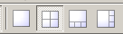

# FreeSurfer勉強会

## 第1部(1) recon-all -autorecon1

### サンプルデータの表示

```
========================================
cd $SUBJECTS_DIR
freeview -v sample-001.mgz \
 sample-002.mgz -layout 2 \
 -viewport sagittal 
========================================
```

- cd: シェルのコマンドで、"change directory" の略です。

- $SUBJECTS_DIR: FreeSurferが画像を保存するディレクトリを示す変数です。この中にsample-001.mgz が入っているので、ここにまず移動します。

- freeview: FreeSurferの画像ビューワーを立ち上げるコマンドです

- -v: volumeデータを表示するときに使います

- \\ は、1行のコマンドを改行して入力したい時に使う記号です。

- -layout 2: Freeviewのレイアウトを決めます。レイアウト2というのは、2x2の表示です。レイアウト1は、ひとつの画面のみ、レイアウト3はひとつの大きな画面の下に3つの小さな画面、レイアウト4はひとつの大きな画面の右に3つの小さな画面です。これは、Freeviewのメニューにある順番となっています。



- -viewport sagittal: 左上の画面に何を表示するかを決めます。今は矢状断が表示されます。オプションとして、sagittal, coronal, axial, 3d があります。


### sample-001.mgz のヘッダーを表示

```
========================================
mri_info sample-001.mgz
========================================
```

- mri_info: FreeSurferに入っている、画像のヘッダー情報を表示するコマンドです


### 勉強会のディレクトリの変数設定

- Lin4Neuro

	```
	===================================
	nisg=/media/sf_share/nisg-202001
	===================================
	```

- MacOS

	```
	===================================
	nisg=~/git/nisg-202001
	===================================
	```


### SUBJECTS_DIRの設定

```
========================================
SUBJECTS_DIR=$nisg/subjects
cd $SUBJECTS_DIR/ernie
========================================
```


- $SUBJECTS_DIR は、自分で変更できます。これを使うことで、任意の場所にFreeSurferの結果を保存できます。


### {rawavg,orig}.mgz のヘッダーを確認

```
========================================
cd mri
mri_info rawavg.mgz
mri_info orig.mgz
========================================
```

- タイトルの{rawavg,orig}.mgz とは、rawavg.mgz と orig.mgz をまとめて表示する方法です。こんな方法もあるんだなと知っていただければ。


### talairach.xfm の確認

```
========================================
cd transforms
cat talairach.xfm
========================================
```

- cat シェルのコマンドで、テキストを表示します。2つ以上のファイルがある場合、テキストを連結して表示します。


### Freeviewで標準化の結果確認

```
========================================
cd $SUBJECTS_DIR
freeview -v fsaverage/mri/mni305.cor.mgz \
 ernie/mri/orig_nu.mgz:reg=ernie/mri/transforms/talairach.xfm
========================================
```

- :reg は、変換パラメーターを適用したい時に使用します。


### 信号値の確認

```
========================================
cd $SUBJECTS_DIR/ernie/mri
freeview -v orig.mgz nu.mgz T1.mgz
========================================
```


### 頭蓋骨除去の確認

```
========================================
freeview -v T1.mgz brainmask.mgz
========================================
```

